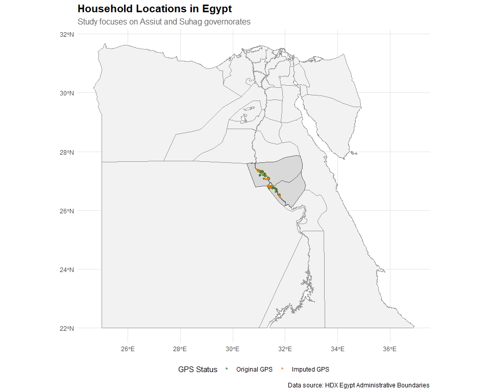
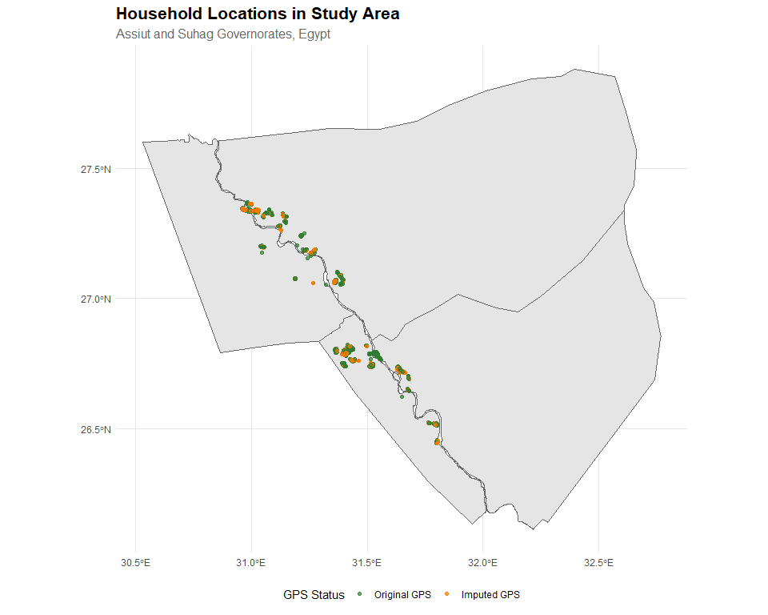

## Overview

This report documents the methodology for imputing missing household GPS coordinates in the Egypt Climate and Migration study dataset. The study focuses on households in the Assiut and Suhag governorates of Egypt.

## Data Summary

The original dataset contains **3,001 households** with GPS coordinates collected from both female and male household respondents. However, significant portions of the GPS data were missing:

- **68%** of male respondent GPS coordinates were missing
- **52.9%** of female respondent GPS coordinates were missing

## Imputation Methodology

We employed a **two-stage imputation strategy** to maximize GPS coverage while maintaining spatial accuracy:

### Stage 1: Cross-Gender GPS Pooling

For each household, we created a consolidated GPS coordinate by:

1. **Prioritizing female respondent GPS** as the primary source
2. **Using male respondent GPS as fallback** when female GPS was missing

This approach leveraged the complementary nature of the two GPS sources, reducing the overall missing rate from 68% to **46%**.

### Stage 2: Geographic Imputation

For households still missing GPS coordinates after Stage 1, we imputed locations using:

1. **Grouping** households by administrative hierarchy: governorate (`govern`) → village (`village_eng`) → agglomeration (`agglom_id`)
2. **Computing median coordinates** within each geographic group
3. **Assigning group medians** to households with missing coordinates

**Note:** 68 households lacked complete administrative information (governorate, village, and agglomeration IDs) and could not be grouped for imputation.

## Results

The two-stage imputation achieved:

- **94% GPS coverage** (2,817 of 3,001 households)
- **17 households** remain without GPS coordinates (located in areas with no reference GPS data)
- **184 households** remain without any geographic identifiers

Table: Summary of GPS Imputation Results

|GPS Status   | Number of Households|Percentage |
|:------------|--------------------:|:----------|
|Original GPS |                 1620|58.0%      |
|Imputed GPS  |                 1173|42.0%      |

## Spatial Distribution of Households

The map below shows the geographic distribution of all households with GPS coordinates (both original and imputed) across Egypt. The study area is concentrated in the Assiut and Suhag governorates in Upper Egypt.

## Study Area Detail

The plot below provides a closer view of the study area, showing the distribution of households within the Assiut and Suhag governorates.

## Imputation Quality

The spatial clustering of imputed GPS points around original GPS points suggests that the geographic imputation methodology successfully preserves the spatial distribution of households within villages and agglomerations.

### Key Observations:

1. **High coverage**: The methodology achieved 94% GPS coverage across the sample
2. **Spatial coherence**: Imputed points cluster appropriately within administrative boundaries
3. **Representative distribution**: The distribution of imputed households mirrors the overall settlement patterns

## Conclusion

The two-stage imputation strategy successfully recovered GPS coordinates for the vast majority of households while maintaining spatial accuracy through group-based median imputation. This allows for robust spatial analysis of climate and migration patterns in the study area.

---

**Technical Note:** This analysis uses the HDX Egypt administrative boundary shapefiles (CAPMAS 2017) and household survey data from the STEG Migration and Climate Change project.
